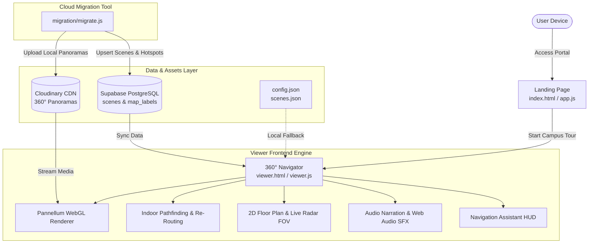

# 🧭 Indoor Campus Navigation System

[](https://developer.mozilla.org/en-US/docs/Web/HTML)
[](https://developer.mozilla.org/en-US/docs/Web/CSS)
[](https://developer.mozilla.org/en-US/docs/Web/JavaScript)
[](https://pannellum.org/)
[](https://supabase.com/)
[](https://cloudinary.com/)
[](https://vercel.com/)

An interactive, web-based **360° Virtual Campus Tour & Indoor Navigation System** developed for university campuses (featured deployment: **Parul University**, CV Raman Center — Extended Reality Lab & Network Architecture Lab).

The system allows students, faculty, and visitors to digitally explore campus facilities, calculate indoor step-by-step walking paths to classrooms and laboratories, view interactive floor plans with synchronized radar field-of-view cones, and listen to voice-guided location tours.

---

## 📑 Table of Contents

- [Key Features](#-key-features)
- [System Architecture](#-system-architecture)
- [Technology Stack](#-technology-stack)
- [Project Directory Structure](#-project-directory-structure)
- [Controls & Keyboard Shortcuts](#-controls--keyboard-shortcuts)
- [Getting Started](#-getting-started)
  - [Prerequisites](#prerequisites)
  - [Local Development Setup](#local-development-setup)
- [Cloud Backend & Migration](#-cloud-backend--migration)
  - [Supabase Schema Setup](#supabase-schema-setup)
  - [Cloudinary & Asset Migration](#cloudinary--asset-migration)
- [Configuration Reference](#-configuration-reference)
  - [config.json (Tour & Hotspots)](#configjson-tour--hotspots)
  - [scenes.json (Floor Coordinates & Labels)](#scenesjson-floor-coordinates--labels)
- [Deployment](#-deployment)
- [Contributing & License](#-contributing--license)

---

## ✨ Key Features

### 🌐 1. Campus Directory & Landing Portal
- **Location Explorer**: Search and filter through campus facilities including departments, libraries, auditoriums, cafeterias, and research labs.
- **Direct Tour Launch**: Quick action buttons to launch immersive 360° virtual tours for specific campus buildings.

### 🔄 2. 360° Panorama Virtual Tour Engine
- Powered by **Pannellum WebGL** with dynamic single-scene memory loading to optimize performance on mobile and desktop devices.
- **Hardware-Aware Texture Protection**: Automatically checks client GPU `MAX_TEXTURE_SIZE` to prevent browser crashes on large equirectangular imagery.
- Smooth scene-to-scene transitions with directional orientation preservation.

### 🚶 3. Intelligent Turn-by-Turn Indoor Navigation
- **Destination Routing**: Select a floor and target room/lab (e.g., L-107 Extended Reality Lab, L-106 Network Architecture Lab).
- **Dynamic Direction Banner**: Displays real-time step counters (`Step X / Y`), walking instructions (*"Go straight ahead"*, *"Turn right"*), and target room indicators.
- **Auto Re-Routing**: If a user wanders off the generated path, the pathfinder dynamically recalculates a new route from the current position.
- **Animated Hotspot Highlights**: Visual directional indicators highlight the correct pathway in 3D panoramic space.

### 🗺️ 4. Interactive 2D Floor Map & Radar Cone
- **Live Location Tracking**: Synchronized map pin indicates the user's current physical scene node.
- **Real-Time Radar FOV**: An interactive directional radar cone reflects the exact yaw/heading and camera perspective on the floor plan as the user rotates in 360°.
- **Pan & Zoom Controls**: Supports mouse drag, desktop wheel zoom, mobile two-finger pinch-to-zoom (up to 6x), and smooth recentering.
- **Built-in Coordinate Editor**: Administrator tools to calibrate pins and map labels directly in the interface.

### 🧭 5. Navigation Assistant HUD
- A futuristic Heads-Up Display (HUD) that continuously scans surroundings and lists available outgoing corridors with relative directions (Ahead, Right, Left, Behind).

### 🎙️ 6. Audio Narration & Ambient Synthesizer
- Context-aware voiceovers triggered upon entering designated laboratories and landmark zones.
- Interactive Web Audio API sound effects for button clicks and magnetic hover states.

---

## 🏛️ System Architecture



---

## 💻 Technology Stack

| Layer | Technologies |
| :--- | :--- |
| **Frontend Core** | HTML5, Vanilla JavaScript (ES6+), Vanilla CSS3 |
| **360° WebGL Rendering** | [Pannellum 2.5.6](https://pannellum.org/) |
| **Typography & Icons** | Google Fonts (*Inter*, *Poppins*), Inline SVG Icons |
| **Audio Engine** | HTML5 Audio, Web Audio API |
| **Database** | [Supabase](https://supabase.com/) (PostgreSQL with Row-Level Security) |
| **Cloud Storage & CDN** | [Cloudinary](https://cloudinary.com/) (360° Equirectangular Panoramas) |
| **Migration Scripts** | Node.js (ESM), `@supabase/supabase-js`, `cloudinary`, `dotenv` |
| **Hosting & Deployment** | [Vercel](https://vercel.com/) (configured via `vercel.json` with immutable asset caching) |

---

## 📂 Project Directory Structure

```plaintext
Indoor-campus-navigation/
├── index.html              # University landing & building directory portal
├── app.js                  # Landing portal search, filtering, and card rendering
├── style.css               # Landing portal styling and responsive layouts
├── viewer.html             # 360° Virtual Tour & Indoor Navigator interface
├── viewer.js               # Core navigation engine, Pannellum controller & HUD
├── viewer.css              # Dark glassmorphism UI styles for viewer & HUD
├── config.json             # Static tour configuration (scenes, hotspots, angles)
├── config.js               # Client credentials config (Supabase & Cloudinary)
├── scenes.json             # 2D floor map coordinates (x, y) & dynamic text labels
├── vercel.json             # Vercel deployment configuration & asset caching headers
├── assets/                 # Graphic assets, floor plans, and panoramic images
│   ├── ground floor/       # High-resolution 360° equirectangular photographs
│   ├── ground_map_view.jpg # Ground floor blueprint image
│   ├── parul university.png# University logo
│   └── ...                 # Equipment preview thumbnails (HoloLens, Quest, etc.)
├── audio/                  # Location voiceover recordings
│   ├── cv_raman.mp3        # CV Raman Center introduction audio
│   └── L-107 and L-106.mp3 # XR & Network Architecture Lab guide audio
├── supabase/
│   └── schema.sql          # Supabase SQL schema definitions and RLS policies
└── migration/              # Cloud data migration utility
    ├── migrate.js          # Automation script: Cloudinary upload & Supabase upsert
    ├── package.json        # Migration tool dependencies
    ├── .env                # Secret environment variables (Supabase & Cloudinary)
    └── .env.example        # Environment variable template
```

---

## 🎮 Controls & Keyboard Shortcuts

The viewer is accessible via mouse, touch gestures, and keyboard:

| Action | Control / Key | Description |
| :--- | :--- | :--- |
| **Look Around** | Click + Drag / <kbd>W</kbd> <kbd>A</kbd> <kbd>S</kbd> <kbd>D</kbd> / <kbd>←</kbd> <kbd>→</kbd> | Pan the 360° panorama camera |
| **Step Forward / Back** | Floor Hotspots / <kbd>↑</kbd> (Forward) / <kbd>↓</kbd> (Back) | Move between panoramic scene nodes |
| **Zoom In / Out** | Mouse Wheel / Pinch Gesture | Change camera Field of View (HFOV) |
| **Indoor Navigation** | <kbd>1</kbd> or <kbd>N</kbd> | Open destination picker panel |
| **Floor Map** | <kbd>M</kbd> | Toggle the interactive 2D floor plan |
| **Grid View** | <kbd>2</kbd> or <kbd>G</kbd> | Browse all scenes in a thumbnail drawer |
| **Fullscreen** | <kbd>3</kbd> or <kbd>F</kbd> | Toggle browser fullscreen mode |
| **Help Modal** | <kbd>4</kbd> or <kbd>H</kbd> | Open navigation instructions |
| **Toggle Arrows** | <kbd>5</kbd> | Show / hide floor navigation hotspot arrows |
| **Audio Narration** | <kbd>K</kbd> | Toggle voiceover audio on / off |
| **Controls Guide** | <kbd>I</kbd> | Reopen quick-start controls guide overlay |
| **Close Dialogs** | <kbd>Esc</kbd> | Dismiss active modals, panels, and popups |

---

## 🚀 Getting Started

### Prerequisites

- A modern web browser supporting **WebGL** (Google Chrome, Mozilla Firefox, Microsoft Edge, or Safari).
- For running the migration script: [Node.js](https://nodejs.org/) (v18.0.0 or later).

### Local Development Setup

Because the application loads JSON files (`config.json`, `scenes.json`) and panoramic media via the `fetch` API, it must be served over an HTTP server (not directly opened via `file://`).

1. **Clone or navigate to the repository directory**:
   ```bash
   git clone https://github.com/SorathiyaDhruvin/Indoor-campus-navigation.git
   cd Indoor-campus-navigation
   ```

2. **Serve the project locally using any static web server**:

   - **Using Python 3**:
     ```bash
     python -m http.server 8000
     ```

   - **Using Node.js (`npx serve`)**:
     ```bash
     npx serve .
     ```

   - **Using VS Code Live Server**:
     Right-click [index.html](file:///c:/Users/sorathiya%20dhruvin/OneDrive/Desktop/Projects/Indoor-campus-navigation/index.html) and select **"Open with Live Server"**.

3. **Open the browser**:
   - Campus Portal: `http://localhost:8000/index.html`
   - Direct 360° Navigator: `http://localhost:8000/viewer.html`

---

## ☁️ Cloud Backend & Migration

The system supports loading tour data either directly from local JSON files or from a cloud-hosted Supabase PostgreSQL backend with Cloudinary CDN storage.

### Supabase Schema Setup

1. Create a project in [Supabase](https://supabase.com/).
2. Open the **SQL Editor** in your Supabase dashboard.
3. Run the schema script located in [supabase/schema.sql](file:///c:/Users/sorathiya%20dhruvin/OneDrive/Desktop/Projects/Indoor-campus-navigation/supabase/schema.sql):
   - Creates `config_globals`, `scenes`, and `map_labels` tables.
   - Configures Row-Level Security (RLS) policies for public read and administrative writes.

### Cloudinary & Asset Migration

A migration utility is provided in the `migration/` directory to automatically upload local panorama images to Cloudinary and insert all nodes into Supabase:

1. Navigate to the `migration` folder:
   ```bash
   cd migration
   ```

2. Install dependencies:
   ```bash
   npm install
   ```

3. Configure environment variables in `migration/.env`:
   ```env
   SUPABASE_URL=https://your-project.supabase.co
   SUPABASE_SERVICE_KEY=your-supabase-service-role-key
   CLOUDINARY_CLOUD_NAME=your-cloud-name
   CLOUDINARY_API_KEY=your-api-key
   CLOUDINARY_API_SECRET=your-api-secret
   ```

4. Execute the migration script:
   ```bash
   npm start
   ```

5. Update the client configuration in [config.js](file:///c:/Users/sorathiya%20dhruvin/OneDrive/Desktop/Projects/Indoor-campus-navigation/config.js) with your project credentials:
   ```javascript
   const CONFIG = {
     supabaseUrl: "https://your-project.supabase.co",
     supabaseKey: "your-supabase-anon-key",
     cloudinaryCloud: "your-cloud-name",
     cloudinaryUploadPreset: "indoor-campus-navigation"
   };
   ```

---

## ⚙️ Configuration Reference

### `config.json` (Tour & Hotspots)

Defines each panoramic node, camera pitch/yaw, initial viewing angle, linked audio, and navigation hotspot connections:

```json
{
  "default": {
    "firstScene": "scene1",
    "sceneFadeDuration": 1200,
    "autoLoad": true,
    "compass": false
  },
  "scenes": {
    "scene1": {
      "title": "CV RAMAN CENTER",
      "panorama": "assets/ground floor/photo1_result.jpeg",
      "audio": {
        "file": "audio/cv_raman.mp3"
      },
      "hfov": 110,
      "northOffset": 0,
      "hotSpots": [
        {
          "pitch": -15,
          "yaw": 0,
          "cssClass": "nav-btn animate-bounce-up",
          "clickHandlerArgs": {
            "sceneId": "scene2",
            "targetYaw": 0
          }
        }
      ]
    }
  }
}
```

### `scenes.json` (Floor Coordinates & Labels)

Maps scene node identifiers to percentage coordinates on the 2D floor plan image:

```json
{
  "scene1": { "x": 59, "y": 68 },
  "scene2": { "x": 59, "y": 64 },
  "_labels": [
    {
      "id": "label_1",
      "text": "System Support Cell",
      "x": 67.2,
      "y": 62.4,
      "size": 6.5,
      "rotation": 0
    }
  ]
}
```

---

## 🚢 Deployment

The project is configured for static web deployment on **Vercel**, **GitHub Pages**, **Netlify**, or standard web servers (Apache, Nginx).

### Deploying to Vercel

1. Push your repository to GitHub / GitLab / Bitbucket.
2. Import the project into the [Vercel Dashboard](https://vercel.com/).
3. The included [vercel.json](file:///c:/Users/sorathiya%20dhruvin/OneDrive/Desktop/Projects/Indoor-campus-navigation/vercel.json) will automatically configure long-term cache headers for media (`.jpg`, `.jpeg`, `.png`, `.webp`) to guarantee low latency.
4. Deploy!

---

## 🤝 Contributing & License

Contributions, bug reports, and feature requests are welcome. Feel free to open an issue or submit a pull request.

Developed for **Parul University Campus Navigation**.  
&copy; 2026 Parul University Indoor Campus Navigation System. All Rights Reserved.
