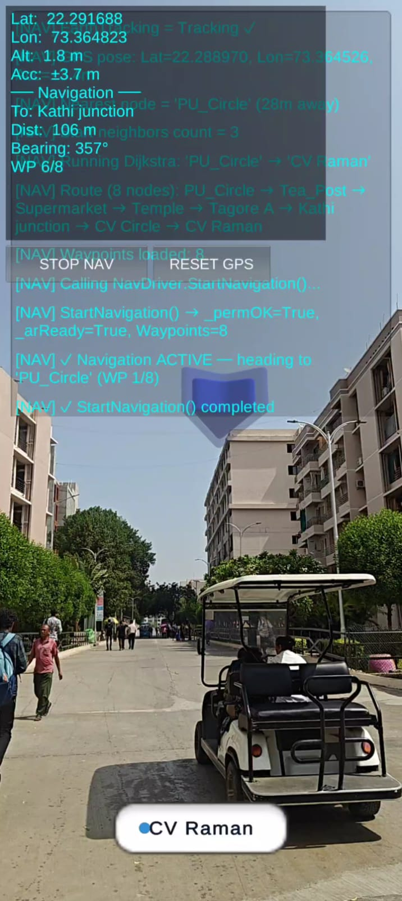
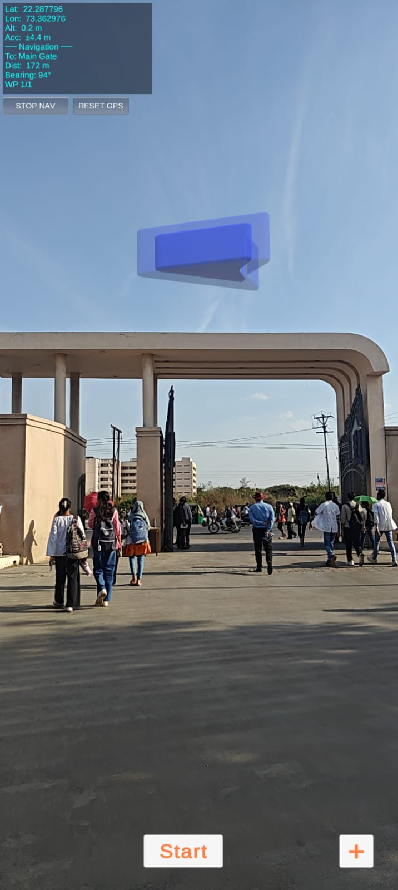

# 🧭 AR Campus Navigation

> **Augmented Reality outdoor campus navigation built with Unity, ARCore Extensions (Google Geospatial API), and AR Foundation.**  
> Point your phone at the real world — a 3D arrow guides you step-by-step to any building, gate, or landmark on campus.

<p align="center">
  
  &nbsp;&nbsp;&nbsp;
  
</p>

---

## ✨ Features

| Feature | Description |
|---|---|
| **Google Geospatial AR** | Sub-metre GPS accuracy via ARCore VPS — no indoor beacons needed |
| **3D Navigation Arrow** | A smooth, DPI-aware AR arrow floats in camera space pointing toward the next waypoint |
| **Dijkstra Pathfinding** | Haversine-weighted shortest-path across a `CampusNode` graph built in the Unity Editor |
| **Destination Search UI** | Google Maps-style bottom-sheet with live search, category badges, and animated slide-up |
| **Multi-waypoint Routing** | Automatically advances through intermediate junction nodes to reach the destination |
| **Geospatial Anchor** | Drops a world-locked 3D marker at the final destination when accuracy is sufficient |
| **Live GPS HUD** | Real-time lat/lon, altitude, accuracy, bearing, and distance overlay |
| **Session Reset** | One-tap GPS & AR session reset without restarting the app |
| **Robust Permission Flow** | Handles Camera + Fine/Coarse Location permissions on Android 12+ with clear error messages |

---

## 📸 Screenshots

### Active Navigation


*Active navigation: 8-node Dijkstra route from PU Circle → Kathi Junction. HUD shows real-time GPS coords, distance, bearing, and waypoint index. The destination chip "CV Raman" is pinned at the bottom.*

---

### App Start / Single Waypoint


*Initial state at the Main Gate entrance. The AR navigation arrow (blue chevron) is visible in the sky; the user taps **Start** to begin routing.*

---

## 🏗 Architecture

```
AR Navigation/
├── Assets/
│   └── Scripts/
│       ├── GeospatialNavigationController.cs  ← Core AR + GPS engine
│       ├── CampusMapManager.cs                ← Route orchestrator (GPS snap + Dijkstra)
│       ├── CampusNode.cs                      ← ScriptableObject: one real-world node
│       ├── Pathfinding.cs                     ← Static Dijkstra over CampusNode graph
│       ├── DestinationSearchUI.cs             ← Bottom-sheet search & destination picker
│       ├── ARNavigationGuide.cs               ← Lightweight onboarding helper
│       └── MobileConsole.cs                   ← On-device debug log overlay
```

### Data Flow

```
User taps "Where To?"
        │
        ▼
DestinationSearchUI  ──search/filter──►  CampusNode assets (ScriptableObjects)
        │  (selected node)
        ▼
CampusMapManager.CalculateNewRoute(CampusNode)
        │  1. snap user GPS → nearest graph node
        │  2. Pathfinding.GetPath()  (Dijkstra, Haversine edge weights)
        │  3. convert path → List<GPSWaypoint>
        ▼
GeospatialNavigationController.StartNavigation()
        │  Update() loop every frame:
        │    M8: poll GPS bearing + Haversine distance
        │    M4: rotate & position AR arrow
        │    M5: advance to next waypoint when within radius
        │    M6: place Geospatial anchor at final destination
        ▼
      ARRIVED  →  ArrivalUI shown
```

---

## 🔧 Tech Stack

| Layer | Technology |
|---|---|
| **Engine** | Unity 6 (URP) |
| **AR Framework** | AR Foundation 6 |
| **Geospatial** | ARCore Extensions — Google Geospatial API (VPS) |
| **Platform** | Android (API 31 minimum, API 36 target) |
| **UI** | Unity UI (uGUI) + TextMeshPro |
| **Pathfinding** | Custom Dijkstra with Haversine edge weights |
| **Language** | C# (.NET Standard 2.1) |

---

## 🚀 Getting Started

### Prerequisites

- Unity **6.x** with **Android Build Support** module installed
- [AR Foundation](https://docs.unity3d.com/Packages/com.unity.xr.arfoundation@6.0/manual/index.html) package
- [ARCore Extensions](https://developers.google.com/ar/develop/unity-arf/getting-started-extensions) package with a valid **Google Cloud API Key** (Geospatial API enabled)
- An Android device that supports **ARCore** and **Google Play Services for AR**

### 1. Clone & Open

```bash
git clone https://github.com/<your-username>/ar-navigation.git
```

Open the project folder in **Unity Hub**.

### 2. Configure the Geospatial API Key

1. In Unity, go to **Edit → Project Settings → XR Plug-in Management → ARCore Extensions**
2. Paste your **Google Cloud API Key** in the *Android API Key* field
3. Ensure `GeospatialMode` is set to **Enabled** on your `ARCoreExtensionsConfig` asset

### 3. Build to Android

1. **File → Build Settings** → select **Android**
2. Click **Switch Platform**
3. Enable **Development Build** for testing
4. Click **Build and Run** with your device connected

> **Tip:** Use a device with a high-quality GPS sensor. Testing outdoors in an open area gives the best Geospatial accuracy (±1–3 m).

---

## 🗺 Adding Campus Nodes

Campus nodes are Unity **ScriptableObjects**. To add or edit them:

1. Right-click in the Project panel → **Create → Campus → Node**
2. Fill in:
   - `nodeName` — human-readable label (e.g. *"Central Library"*)
   - `latitude` / `longitude` — decimal-degree GPS coordinates
   - `neighbors` — drag other `CampusNode` assets to connect walkable paths
   - `isDestination` — ✅ tick for buildings/gates a user can navigate **to**; leave unchecked for junction/intersection routing nodes
   - `destinationCategory` — badge label: `Academic` | `Food` | `Admin` | `Hostel` | `Entrance` | `Medical`
   - `destinationDescription` — short subtitle shown in the search list
3. Assign all nodes to `CampusMapManager.AllCampusNodes` in the Inspector

---

## ⚙️ Key Script Reference

### `GeospatialNavigationController`
The heart of the app. Modular coroutine pipeline:

| Module | Responsibility |
|---|---|
| **M1** | Android permission flow (Camera + Fine/Coarse Location) |
| **M2** | Wait for `ARSession` & validate `GeospatialMode = Enabled` |
| **M3** | Haversine distance & bearing math |
| **M4** | 3D AR arrow — build, position, and slerp-rotate |
| **M5** | Waypoint advance — check arrival radius, progress route |
| **M6** | Geospatial anchor placement at the final destination |
| **M7** | DPI-aware on-GUI HUD overlay |
| **M8** | GPS polling at configurable interval |
| **M9** | Full session reset (AR + GPS) |

### `CampusMapManager`
- Snaps the user's live GPS position to the nearest graph node
- Runs **Dijkstra** via `Pathfinding.GetPath()` to find the shortest walkable route
- Converts the result to `GPSWaypoint` objects and hands them to `GeospatialNavigationController`
- Exposes a `RouteCalculated` event for analytics/logging

### `DestinationSearchUI`
- Bottom-sheet panel with slide animation (`SmoothStep` lerp)
- Live search filters `CampusNode.nodeName`, `destinationCategory`, and `destinationDescription`
- Category colour mapping configurable in the Inspector
- Calls `CampusMapManager.CalculateNewRoute(CampusNode)` (object overload — avoids name collision issues)

### `Pathfinding` (static)
- **BFS** first-pass to discover all reachable nodes from the start
- **Dijkstra** with Haversine great-circle distance as edge weight
- Returns an ordered `List<CampusNode>` (start → … → destination), or `null` if no path exists

---

## 🐛 Troubleshooting

| Symptom | Fix |
|---|---|
| Black camera / no AR | Grant Camera permission; ensure ARCore is installed on device |
| "GeospatialMode NOT Enabled" | Set `GeospatialMode = Enabled` on the `ARCoreExtensionsConfig` asset |
| GPS stuck at "Earth: Limited" | Go outdoors, sweep the phone slowly — VPS needs a sky view |
| Arrow doesn't point correctly | Check that `AREarthManager` is assigned; verify compass is enabled |
| Route always fails | Ensure start and destination nodes are connected via `neighbors` in both directions |
| Very low GPS accuracy | Wait until `Acc` on HUD drops below `±5 m`; tap **RESET GPS** if stuck |

---

## 📋 Permissions Required

| Permission | Reason |
|---|---|
| `CAMERA` | AR camera feed |
| `ACCESS_FINE_LOCATION` | Sub-metre GPS for Geospatial API |
| `ACCESS_COARSE_LOCATION` | Required fallback on Android 12+ |

---

## 🗺 Campus Tested On

> **Parul University** — Vadodara, Gujarat, India  
> Approx. coverage area: Main Gate ↔ PU Circle ↔ CV Raman ↔ Kathi Junction  
> Coordinates: ~22.2887° N, 73.3637° E

---

## 📄 License

This project is released under the **MIT License**. See [LICENSE](LICENSE) for details.

---

## 🙏 Acknowledgements

- [Google ARCore Extensions](https://developers.google.com/ar/develop/unity-arf) — Geospatial API
- [Unity AR Foundation](https://unity.com/unity/features/arfoundation) — cross-platform AR layer
- [TextMeshPro](https://docs.unity3d.com/Packages/com.unity.textmeshpro@3.0/manual/index.html) — UI text rendering
